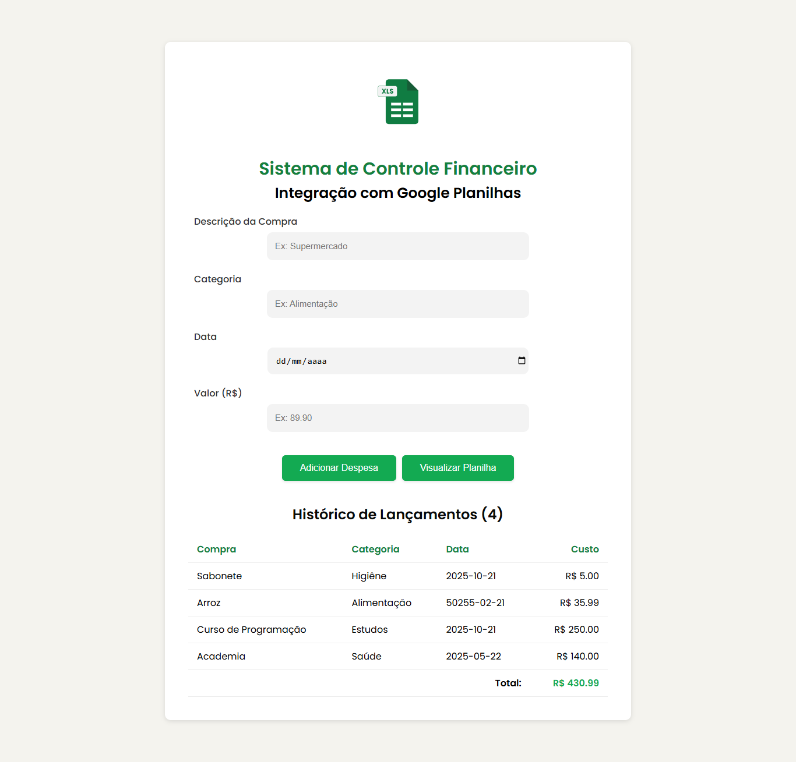

# Sistema de Controle Financeiro de Compras + API Google Planilhas

Aplicação **React + Vite** desenvolvida para o **gerenciamento de despesas e controle financeiro**, com **integração direta ao Google Planilhas**.  




O sistema permite adicionar novas despesas através de um formulário dinâmico — ao clicar em **"Adicionar Despesa"**, as informações são registradas **tanto no frontend** quanto **automaticamente na planilha**, mantendo os dados sempre sincronizados em tempo real.  

---

## 🚀 Tecnologias e Bibliotecas Utilizadas

- **React + Vite** — estrutura base do projeto, garantindo performance e desenvolvimento ágil.  
- **Axios** — utilizada para realizar requisições HTTP (`POST` e `GET`) com a API externa, armazenando os dados em `useState` e exibindo-os dinamicamente através do `useEffect`.  
- **Google Sheets + Sheet.best API** — responsáveis por transformar a planilha em uma **API REST**, permitindo o envio e recuperação de dados de forma automática e integrada.  

---

## ⚙️ Principais Funcionalidades

- 🧮 Adicionar novas despesas via formulário.  
- 🔄 Sincronização automática entre frontend e Google Planilhas.  
- 📊 Visualização dinâmica dos dados salvos diretamente na tela.  
- 🌐 Integração simples e eficiente com a 
<a href="https://sheetbest.com/?gad_source=1&gad_campaignid=21005879900&gbraid=0AAAAA9S5-CiSfa3zNJ0tPMOTCJE5KuFBv&gclid=CjwKCAiAlfvIBhA6EiwAcErpyR0E3M2EZ8cyN2AaSiy9jnIKBb05nzMBfyQwgAKr0nydw-bfK74d3hoC0_kQAvD_BwE
" target="_blank">Google Sheets API</a>
 

---

## 🔑 Integração com API

A comunicação entre o app e o Google Planilhas é feita por meio de uma **chave de API e uma URL de conexão**, fornecidas pela **Sheet.best**, garantindo o envio e recebimento seguro dos dados.  

---

## 🔑 Futuras Melhorias
- Adicionar Funcionalidade de Subtração de Custos
- Criar versão Mobile (carteira digital) utilizando React Native
- Adicionar Graficos e Status (Instalando novas bibliotecas)

## 💻 Como Executar o Projeto

```bash
# Clone este repositório
git clone https://github.com/Controle-Financeiro-Sheets-API.git

# Acesse a pasta do projeto
cd controle-Financeiro-Sheets-API

# Instale as dependências
yarn install

# Execute o servidor de desenvolvimento
yarn run dev
